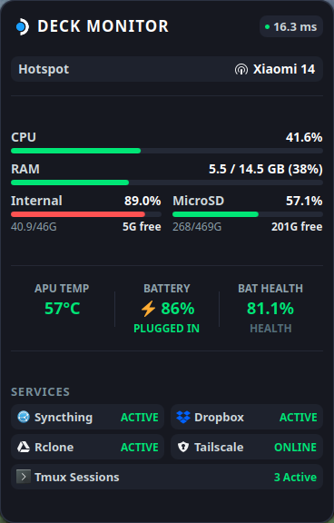

# 🎮 Steam Deck Desktop Monitor Widget

<p align="center">
  
</p>

<p align="center">
  A sleek, lightweight, and comprehensive desktop monitoring widget designed specifically for the <b>Steam Deck</b> running <b>KDE Plasma 6</b>.
  <br />
  Built with native QML and an ultra-lightweight zero-dependency Python background daemon (<10MB RAM).
</p>

---

## 🌟 Key Highlights & Philosophy

- **Unified "Quick Skimming" Visual Language**:
  - With a single glance, **All Green = 100% Safe & Healthy**.
  - Dynamic threshold color shifting: **Green** (Safe/Optimal) $\rightarrow$ **Orange** (Moderate/Warm) $\rightarrow$ **Red** (High/Critical).
- **Plug-and-Play External Drives**:
  - Automatically detects external USB drives, SSDs, and hard drives plugged directly or via USB-C Dock.
  - Displays partition labels, usage percent, free space, and dynamically disappears upon unmounting.
- **Smart Wi-Fi & Hotspot Detection**:
  - Clean monochromatic wireless indicators. Automatically switches to a dedicated **Hotspot icon** when tethered to mobile devices (Android/iPhone).
- **Clean Minimalist Design**:
  - Official Steam Deck branding with connection status indicator.
  - Borderless APU temperature and battery gauges with subtle vertical separator lines.
  - Full appearance customization via KDE Plasma settings (font size slider with live preview).

---

## ⚡ Monitored Metrics

### 🖥️ Hardware & Storage
- **CPU Usage**: Real-time percent with dynamic color progress bar.
- **RAM Usage**: Used vs. Total GB (e.g. `5.5 / 14.5 GB`), percent, and progress bar.
- **Internal Storage**: `/home` partition usage, used/total GB, and free space.
- **MicroSD Card**: Storage status with inserted/unmounted detection.
- **External Storage**: Dynamically displayed upon connection with automatic `GB` / `TB` unit scaling.

### 🌡️ Thermals & Battery
- **APU Temperature**: Real-time sensor readout calibrated for Steam Deck Zen 2 APU thermal thresholds (Green `<70°C`, Orange `70-84°C`, Red `≥85°C`).
- **Battery & Charging**: Accurate percentage, charging state (`CHARGING` / `PLUGGED IN` / `DISCHARGING`), and `⚡` indicator.
- **Battery Health**: True health percentage based on battery design capacity (`charge_full` / `charge_full_design`).

### 🌐 Network & Services
- **Wi-Fi / Hotspot**: Active SSID with smart tethering detection.
- **Ping Latency**: Millisecond ping to global DNS (`1.1.1.1`) with dynamic color status dot (Green `≤80ms`, Orange `81-150ms`, Red `>150ms / Offline`).
- **Syncthing**: Sync daemon active state.
- **Dropbox**: File sync status with official icon.
- **Rclone (Google Drive)**: Cloud mount daemon state.
- **Tailscale**: VPN mesh node status (`ONLINE` / `OFF`).
- **Tmux Sessions**: Real-time counter of active background terminal sessions.

---

## 🚀 Quick Installation

Open a terminal on your Steam Deck Desktop Mode and run:

```bash
git clone https://github.com/ryansetia1/steamdeck-monitor-widget.git
cd steamdeck-monitor-widget
chmod +x install.sh
./install.sh
```

### What the installer does:
1. Installs the lightweight background daemon to `~/.local/bin/deck-monitor-daemon.py`.
2. Sets up and starts the systemd user service (`deck-monitor.service`).
3. Installs the Plasma 6 plasmoid to `~/.local/share/plasma/plasmoids/org.ryan.deckmonitor`.
4. Automatically attaches the widget to your desktop.

---

## 🛠️ Management & Controls

### Service Commands
```bash
# Check status
systemctl --user status deck-monitor.service

# Restart daemon
systemctl --user restart deck-monitor.service

# View live daemon metrics (JSON)
curl -s http://127.0.0.1:19842/status | python3 -m json.tool
```

### Appearance Settings
Right-click the widget on your desktop $\rightarrow$ select **Configure Deck Monitor...** $\rightarrow$ adjust the **Font Size** slider to scale the widget size to your preference.

---

## 🗑️ Uninstallation

To cleanly remove the widget, plasmoid, and systemd daemon:

```bash
./uninstall.sh
```

---

## 📜 License
MIT License © [ryansetia1](https://github.com/ryansetia1)
